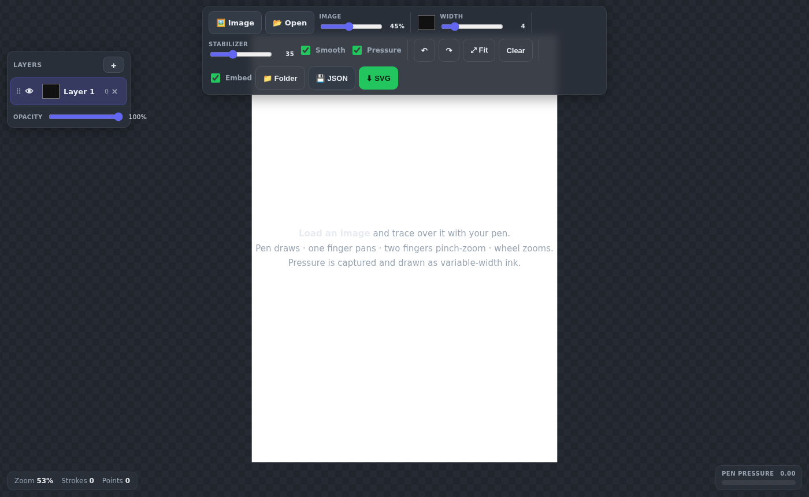

# Tracer

A pen-first tracing surface for stylus-enabled devices. Load a reference image, drop its opacity, and trace over it with pressure-sensitive ink — all in a single self-contained HTML file with no build step and no dependencies.



---

## Features

- **Pressure-sensitive ink** — pen pressure is captured per point and rendered as variable line width, so strokes naturally taper and swell.
- **Pen stabilizer** — an EMA (exponential moving average) smooths hand jitter in real time. Non-destructive: raw points are always preserved.
- **Catmull-Rom curves** — optional spline interpolation for flowing, organic strokes. Also non-destructive.
- **Multiple layers** — each layer has its own colour, visibility toggle, and opacity slider. Drag the grip handle to restack layers. Rename layers by double-clicking.
- **Undo / redo** — full stroke-level history across all layers (`Ctrl/Cmd+Z` / `Ctrl/Cmd+Shift+Z`).
- **Portable JSON projects** — save as `.json` (lossless: artboard size, all layers, raw `{x, y, pressure, t}` points, and drawing-processing settings). Optionally embeds the reference image as a data URL. View state and UI-only preferences reset when reopened.
- **SVG export** — export processed paths per layer as `<g>` groups, with pressure baked into variable-width outlines.
- **Folder connect** — connect a local folder via the File System Access API (Chromium) to write files straight into it instead of downloading.
- **Zero setup** — single HTML file, works entirely offline, opens directly from disk.

---

## Getting started

### Option A — open locally

Download [`index.html`](index.html) and open it in your browser. No server required.

```
# clone the repo, then:
open index.html          # macOS
start index.html         # Windows
xdg-open index.html      # Linux
```

### Option B — GitHub Pages

When the repository is public and GitHub Pages is enabled, the live version is deployed automatically on every push to `main`:

**https://utrost.github.io/Tracer/**

While the repository is private, open `index.html` locally or serve the checkout from `localhost` for PWA/service-worker testing.

### Documentation

- [User handbook](docs/user-handbook.md) — first tracing session, layers, saving, SVG export, PWA install, and troubleshooting.
- [Architecture](docs/architecture.md) — state model, rendering pipeline, persistence, PWA behavior, and current trade-offs.

### Regression checks

The distributable remains the single `index.html` file. The dependency-free
core regression checks can be run with:

```sh
npm test
```

or directly with:

```sh
node tests/tracer-core.test.cjs
```

---

## Usage

1. **Load a reference image** — click **Image** or drag and drop an image file onto the canvas.
2. **Adjust opacity** — use the **Image** slider to fade the reference so your tracing layer stands out.
3. **Draw** — use a stylus (or mouse) to trace. The pen tool is always active.
4. **Add layers** — click **+** in the Layers panel to separate elements (e.g. pencil underdrawing, ink, shadow).
5. **Save** — click **JSON** to save a lossless project, or **SVG** to export the finished artwork.

---

## Controls

### Input

| Device | Action |
|---|---|
| Pen / mouse | Draw |
| One finger | Pan |
| Two fingers | Pinch-zoom |
| Mouse wheel | Zoom |

### Keyboard

| Shortcut | Action |
|---|---|
| `Ctrl/Cmd + Z` | Undo |
| `Ctrl/Cmd + Shift + Z` | Redo |

### Toolbar

| Control | Description |
|---|---|
| **Image** | Load a reference image |
| **Open** | Open a saved `.json` project |
| **Image opacity** | Fade the reference (0–100%) |
| **Colour picker** | Set the active layer's colour |
| **Width** | Base stroke width in artboard units |
| **Stabilizer** | EMA smoothing strength (0 = off, 100 = maximum) |
| **Smooth** | Toggle Catmull-Rom curve interpolation |
| **Pressure** | Toggle pressure-to-width rendering |
| **Undo / Redo** | Step through stroke history |
| **Fit** | Fit the artboard into the viewport |
| **Clear** | Clear all strokes on the active layer |
| **Embed** | Embed the reference image inside the JSON on save |
| **Folder** | Connect a local folder for direct file writes (Chromium only) |
| **JSON** | Save a lossless project file |
| **SVG** | Export processed artwork |

---

## File formats

### JSON (`.json`)

Lossless project format. Stores artboard dimensions, all layer metadata, and raw `{x, y, p, t}` points for every stroke. With **Embed** checked, the reference image is saved as a data URL inside the file — making the project fully portable and self-contained.

```jsonc
{
  "type": "vhs-trace",
  "version": 3,
  "artboard": { "width": 2480, "height": 3508 },
  "image": { "name": "reference.png", "data": "data:image/png;base64,…" },
  "layers": [
    {
      "name": "Ink",
      "color": "#111111",
      "visible": true,
      "opacity": 1,
      "strokes": [
        { "color": "#111111", "width": 4,
          "points": [{ "x": 120.5, "y": 340.2, "p": 0.72, "t": 1718000000000 }] }
      ]
    }
  ]
}
```

### SVG (`.svg`)

Each visible layer is exported as a `<g data-layer="…">` group. When **Pressure** is on, strokes are rendered as filled outline polygons with pressure baked in. When off, strokes are `<path>` elements with a fixed `stroke-width`.

---

## Browser compatibility

| Browser | Draw | Pressure | Folder connect |
|---|---|---|---|
| Chrome / Edge (desktop) | ✅ | ✅ | ✅ |
| Chrome (Android) | ✅ | ✅ | ✅ |
| Safari (iPad + Apple Pencil) | ✅ | ✅ | ❌ |
| Firefox | ✅ | ✅ | ❌ |

> **Folder connect** requires the [File System Access API](https://developer.mozilla.org/en-US/docs/Web/API/File_System_Access_API), currently supported in Chromium-based browsers only. On unsupported browsers the button is hidden and files download normally.

---

## Relationship to VHS

Tracer started as `TracerUI` inside the [VHS](https://github.com/utrost/VHS) (Vector Handwriting System) repository and was migrated here to give it a dedicated home. It shares stabilisation mechanics (EMA stabilizer, Catmull-Rom curves) with the GlyphCollector in VHS but is an independent application.
