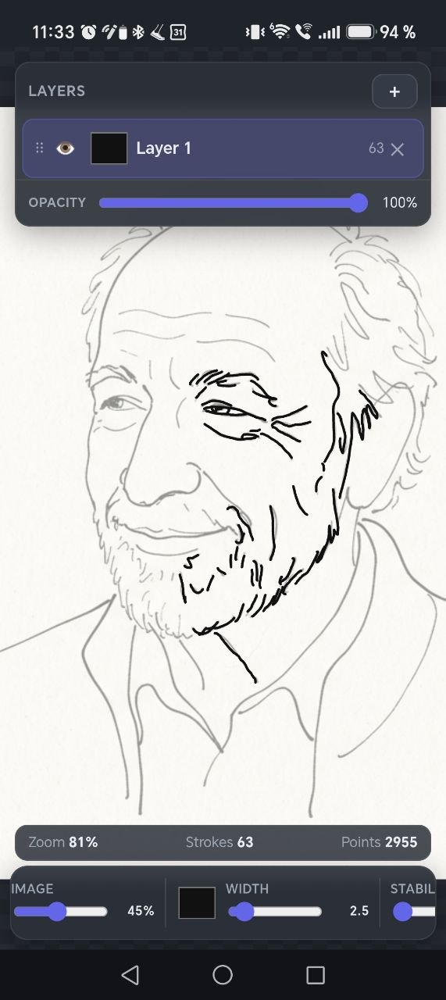

# Android portrait tracing screenshot — 2026-08-05

## Context

- Device/browser: Android phone screenshot; exact device and browser not recorded in the image.
- Subject: portrait reference image traced by hand in Tracer.
- Capture type: in-progress screen capture, not a finished drawing or measured plot/scan.

## Visible Tracer state

- Reference image opacity: 45%.
- Zoom: 81%.
- Active layer: `Layer 1`, black ink, 100% opacity.
- Stroke count: 63.
- Point count: 2,955.
- Base width: 2.5.
- Stabilizer: enabled at a low setting.

## Observation

This is a real tracing session on the mobile layout. The controls remain reachable while the canvas is zoomed, and the faded reference image leaves enough contrast for the live ink layer. The current strokes are sparse and uneven in a useful way: brow, eye, cheek, ear, and beard marks carry most of the likeness without tracing every source line.

The screenshot is mainly UI and workflow evidence. It does not prove SVG export quality, JSON reopen behavior, or plotter output.
